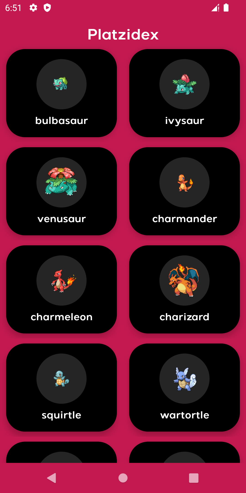
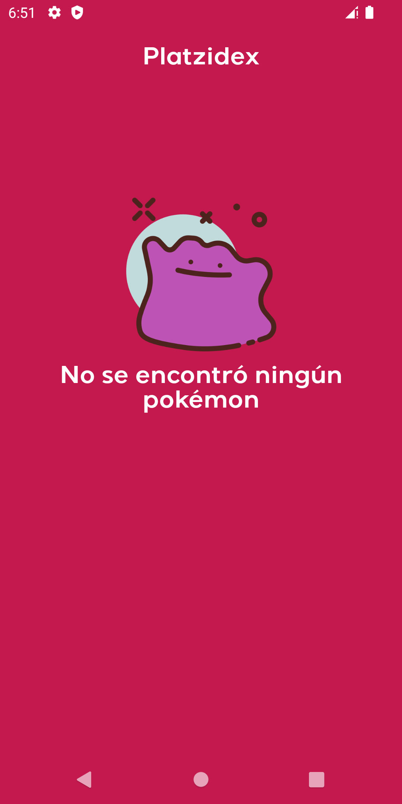
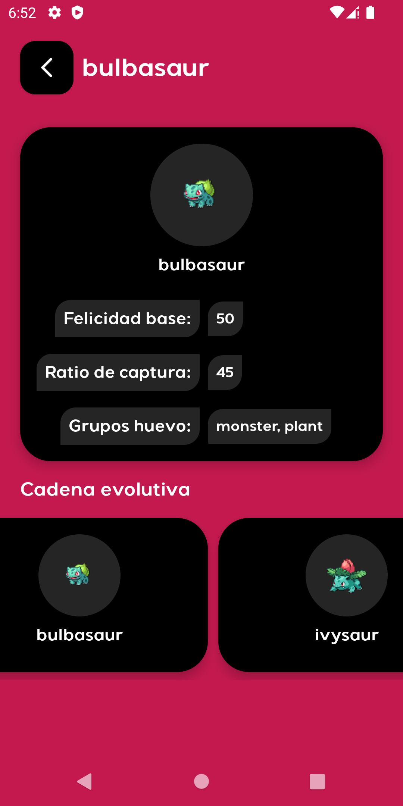
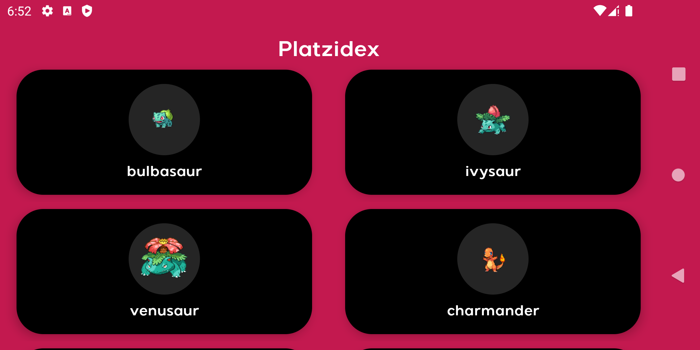
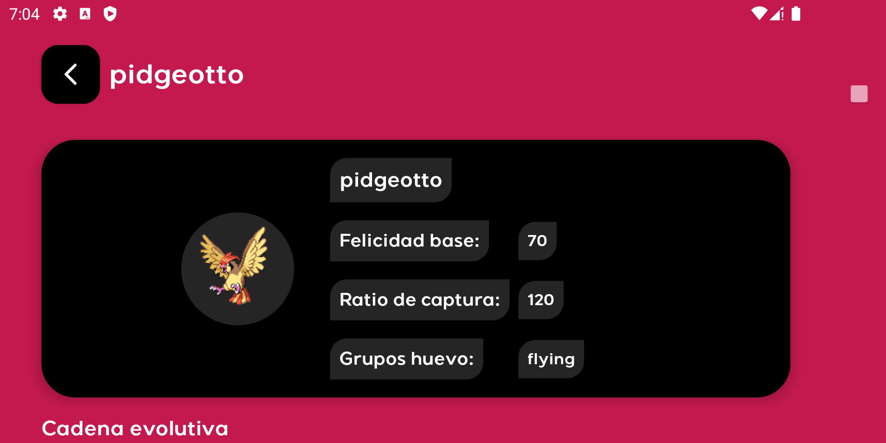
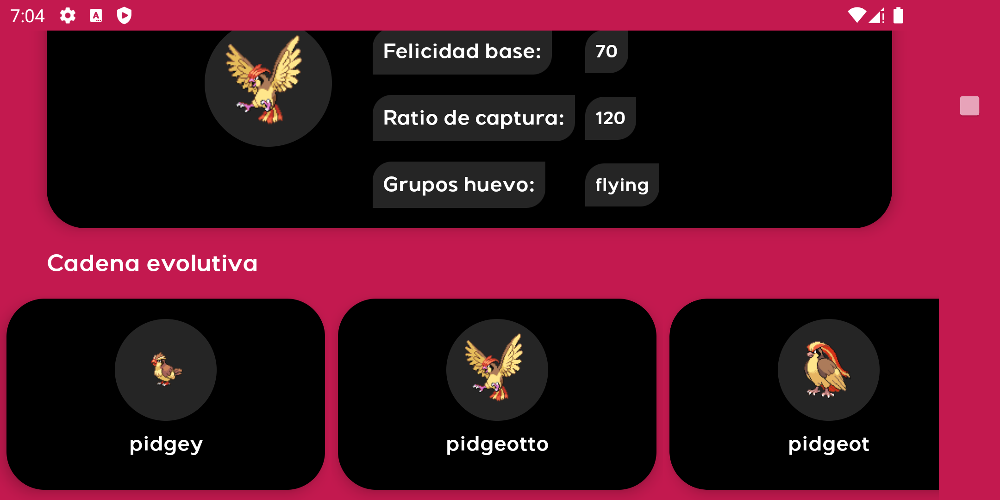
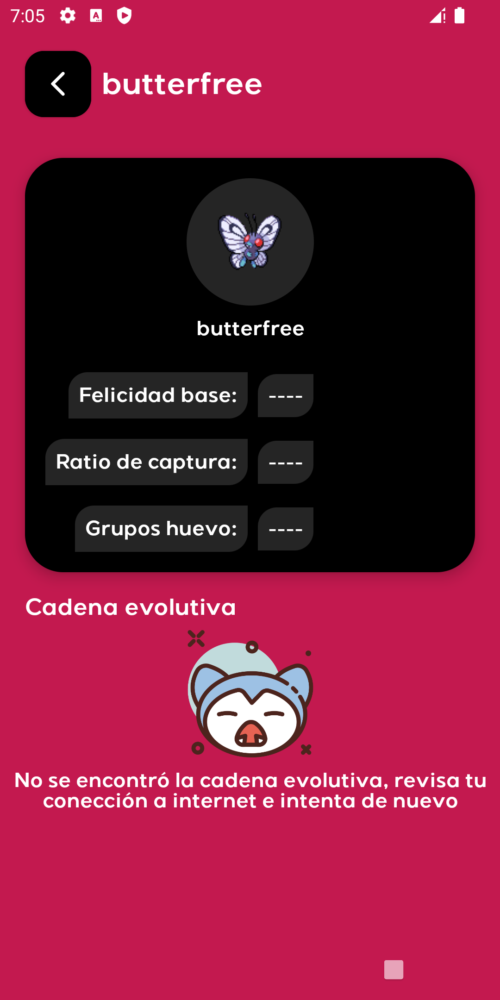

# Platzidex

Esta app está hecha teniendo en mente el articulo oficial de google [Guide to app architecture](https://developer.android.com/jetpack/guide)

La arquitectura de la app sigue estos conceptos: Clean Architecture, TDD, Single Activity, MVVM, Offline First.

La app se adapta a todos los cambios de configuración. (split screen, landscape, portrait).

